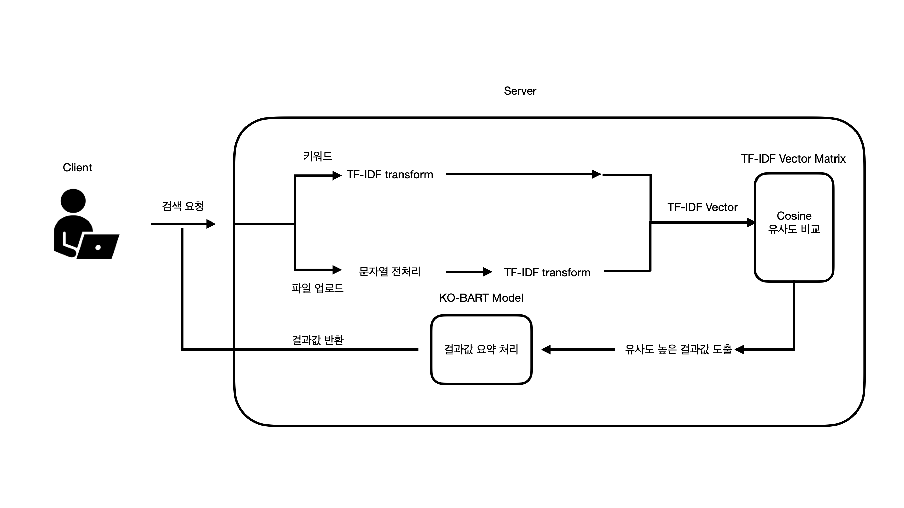

# KB The 5th Future Finance A.l. Challenge
- 개요 : 키워드 작성 혹은 파일 업로드로 해당 요청값과 유사한 파일 검색 SW

- 현 문제 : 

    시행문, 품의문 작성 시 기작성 문서 기반 하 작성. 
    다만, 유사한 문서를 검색하는 과정에 소모되는 시간이 많음

- 해결 방안 :

    요청된 키워드 혹은 문서 기반으로 검색을 허용할 폴더 내 문서들과 유사도 비교 후 
    가장 유사도가 높은 문서 리스트를 제공

- 기대 효과 : 
  
    기존 시행문, 품의문 작성 소요 시간을 현저하게 줄일 수 있을 것이라고 판단

- 참고 :

    *KB국민은행 제5회 Future Finance A.I. Challenge 「현직자 Pick」 리스트

---

# 목차

1. [EXPORT](#export)
2. [TEST](#test)
3. [키워드 별 유사한 파일 찾기](#1-키워드-별-유사한-파일-찾기)
4. [파일 업로드 검색 기능](#2-파일-업로드-검색-기능)
5. [데이터 전처리](#데이터-전처리)
6. [서비스 프로세스](#서비스-프로세스)

---

# EXEC

- 아래 절차에 따라 배포된 도커 이미지로 **프로토타입**을 **직접 실행**하실 수 있습니다.

---

## 0. 도커 다운로드

1. https://www.docker.com/ 방문하여 현재 환경에 맞는 파일 다운로드 및 실행

## 1. 도커 컨테이너 구동

```
docker run -itd \
--name kb-fast \
-p 8000:8000 \
-e SEARCH_DIRECTORY_PATH='/app/KB/file' \
-e KOBART_MODEL_PATH='/app/KB/ko-bart' \
rubat0/kb-fast-app
```

- **같은 경로에 다운로드 후 명령어 시행**
- `rubat0/kb-fast-app` : 배포 도커 이미지를 활용하여 컨테이너 구동
2. `-e SEARCH_DIRECTORY_PATH` : 파일 유사도 검색 시, 조회할 폴더 경로 환경변수 지정
3. `-e KOBART_MODEL_PATH` : 파일 요약 시, 사용할 KO-BART 모델 경로 환경변수 지정

---

# 기능 설명

## 1. 키워드 별 유사한 파일 찾기

1. http://127.0.0.1:8000/ **메인 페이지 방문**	

2. **키워드 검색**

- 비동기 요청 처리로 요약이 **먼저 처리된 문서부터** 요약 내용을 렌더링함
- 해당 키워드와 관련된 문서 5개 추천


## 2. 파일 업로드 검색 기능

- 현재 버전에선 `txt`, `docx`  파일만 업로드 가능

- 업로드 파일 요약본 제공

- 업로드 파일과 **유사한 파일 5개 추천** 및 **추천 파일 요약본** 제공

- **유사한 파일** **다운로드** 가능

  

  

  

---

# 데이터 전처리

- 학습 데이터셋 : AI Hub 문서 요약 테스트 - 뉴스 기사 **24만건**
- 특수문자 제거 : 의미 파악에 불필요하다고 판단, 길이 축소 위해 제거
- 데이터 컬럼 중 `text`, `abstractive`  만 사용하여 행 별로 데이터 추출 및 `tsv` 확장자로 별도 학습 데이터 저장

- 불용어처리 -> tf-idf 이용한 문서 유사도 비교 목적, 문서 요약에는 사용 X

---

# 서비스 프로세스


