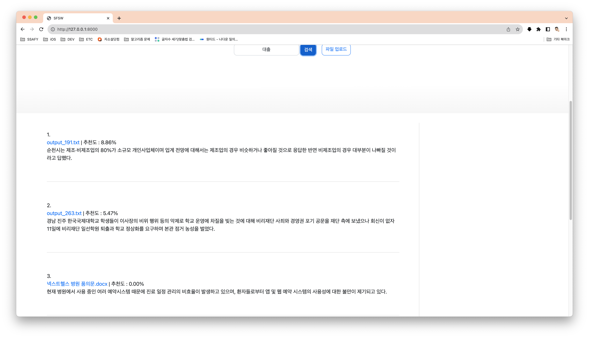
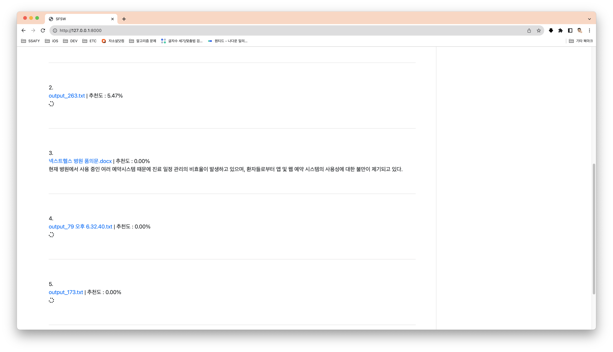
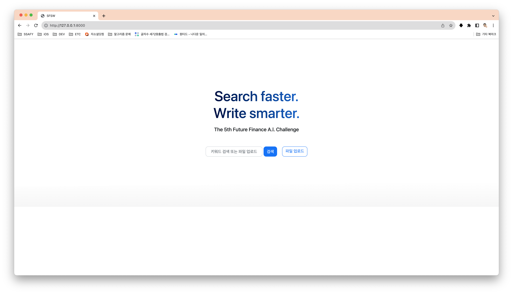
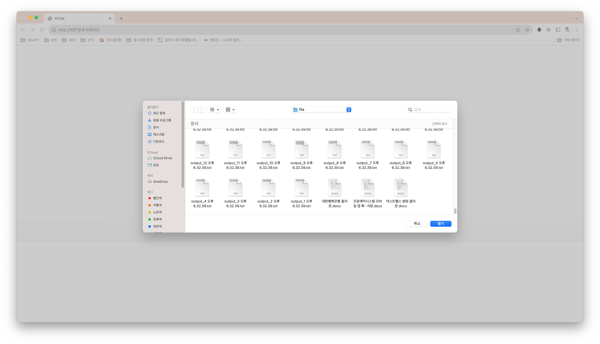
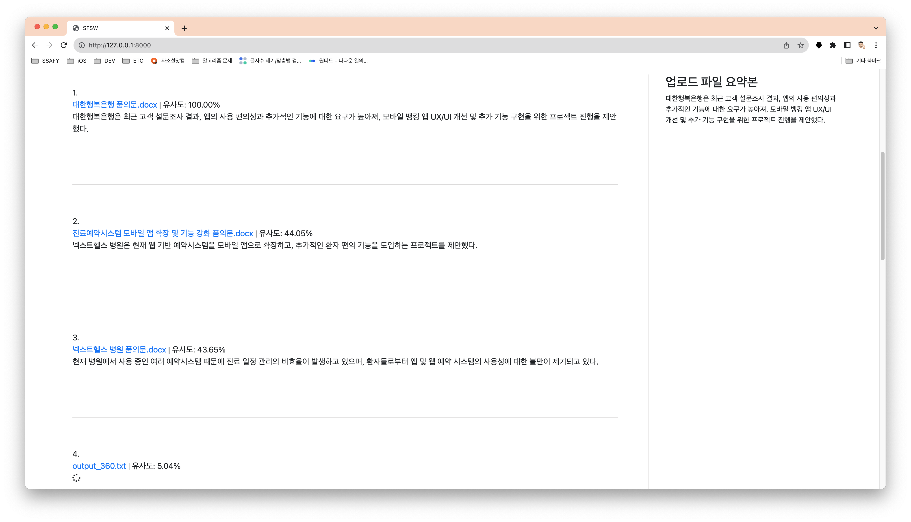
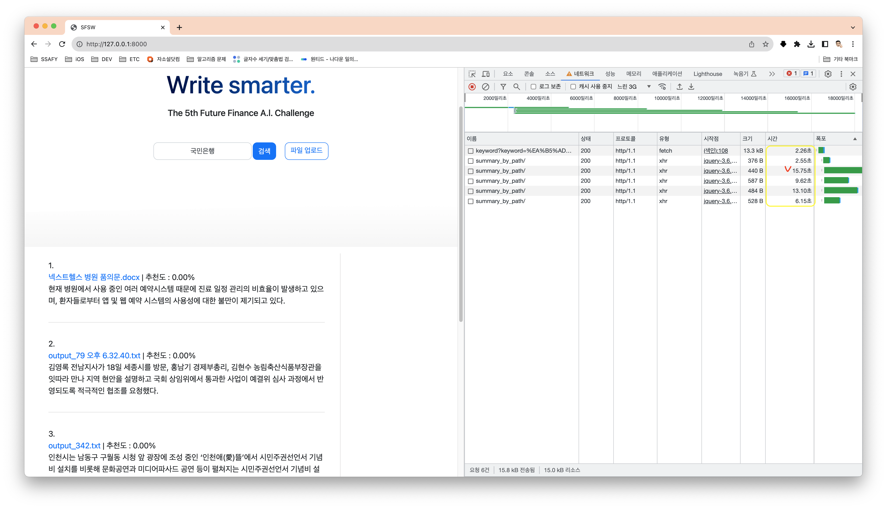
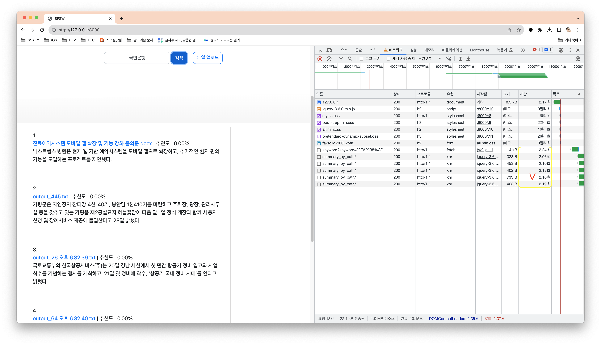

# KB financial 공모전
**유사문서 검색 및 요약 서비스**

⇒ 기존 작성되어 있는 행내 각종 품의문, 시행문을 원하는 내용 키워드 검색 또는 파일 업로드를 통해

**가장 적합한 문서를 찾는 검색 AI**

⇒ 본부부서에서 각종 시행문, 품의문 작성 시 기존에 작성했던 유사한 문서를 참고하는 경우가 많기 때문에 원하는 양식을 AI가 인식하여 쉽게 검색할 수 있다면 업무시간 단축이 가능할 것으로 생각함 검색 키워드에 맞는 각종 품의문이나 시행문을 가장 조회수가 높거나 저장횟수가 많은 것부터 나열하는 등으로 중요도를 AI가 판정하여 제시해준다면 문서탐색시간을 줄일 수 있을 것으로 생각함

---

# 목차

1. [EXPORT](#EXPORT)
2. [TEST](#TEST)
3. [기능 - 키워드 별 유사한 파일 찾기](## 1. 키워드 별 유사한 파일 찾기)
4. [기능 - 파일 업로드 검색 기능](## 2. 파일 업로드 검색 기능)
5. [기능 설명](# 기능 설명)

---

# EXPORT

## 0. 도커 다운로드

1. https://www.docker.com/ 방문하여 현재 환경에 맞는 파일 다운로드 및 실행

## 1. 도커 컨테이너 구동

```
# Dockerfile 다운로드
wget https://raw.githubusercontent.com/JAY-Winter/KB/main/Dockerfile

# Docker-Compose 파일 다운로드
wget https://raw.githubusercontent.com/JAY-Winter/KB/main/docker-compose.yml

# 구동 명령어
docker-compose up -d
```

- 같은 경로에 다운로드 후 명령어 시행

---

# TEST

## 0. 도커 컨테이너 구동(위 내용 참고)

## 1. 키워드 별 유사한 파일 찾기

1. http://127.0.0.1:8000/ **메인 페이지 방문**	

2. **키워드 검색**

- 비동기 요청 처리로 요약이 **먼저 처리된 문서부터** 요약 내용을 렌더링함
- 해당 키워드와 관련된 문서 5개 추천





## 2. 파일 업로드 검색 기능

- 현재 버전에선 `txt`, `docx`  파일만 업로드 가능

- 업로드 파일 요약본 제공

- 업로드 파일과 **유사한 파일 5개 추천** 및 **추천 파일 요약본** 제공

- **유사한 파일** **다운로드** 가능

  

  

  

---

# 기능설명

## 1. 캐시를 활용한 응답 속도 개선

- **결과 : 관련 문서 요약 총 응답 시간 15.75 -> 2.16**

- 초기 검색

  

- 재검색 결과 값

  

